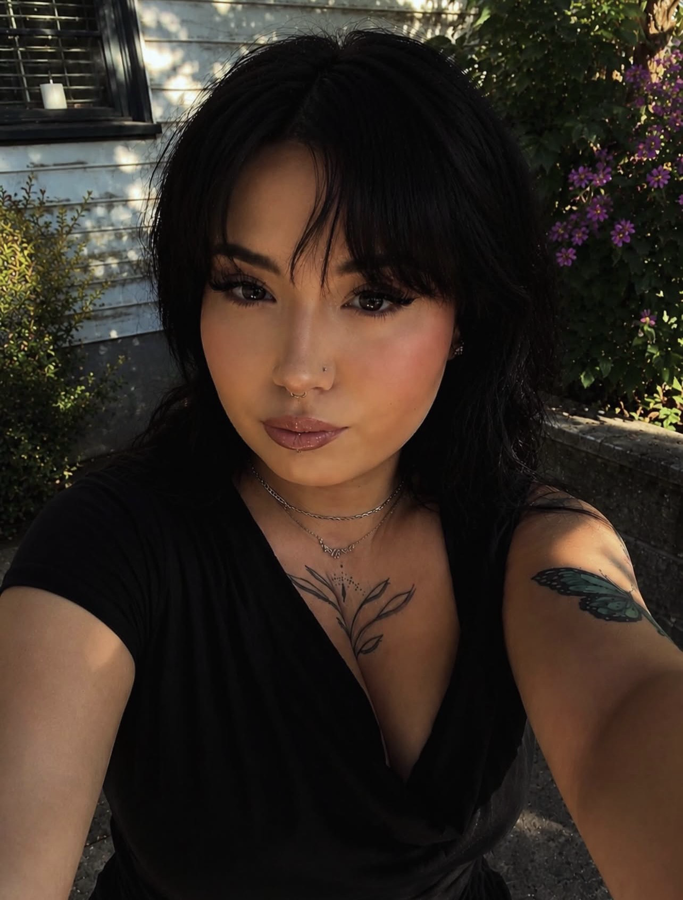
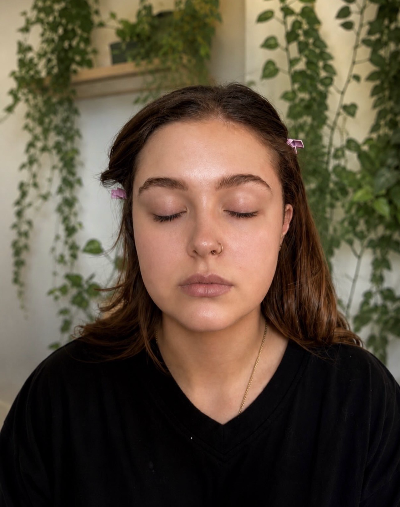

*Soft glam · Editorial · Everyday looks · Special occasions*

Based in Denver &nbsp;\|&nbsp; Available for bookings

---

## About Me

Hi, I'm Allie 

I work with all skin tones and face shapes. Every look is customized to you.

  <i>Soft Glam</i>  
  Dewy skin, defined lashes, neutral-to-warm tones  
  <i>Editorial</i>  
  Bold, creative looks for shoots and events  
  <i>Everyday Glam</i>  
  Wearable, polished looks for day-to-day  
  <i>Special Occasion</i>  
  Weddings, quinceañeras, proms, events

  
---

## Services

<!-- Calendly inline widget -->

<form action="[https://formspree.io/f/YOUR_FORM_ID](https://formspree.io/f/mykaoayl)" method="POST" style="max-width:500px;margin:0 auto;">
  <input type="text" name="name" placeholder="Your name" required style="width:100%;padding:0.6rem;margin-bottom:0.75rem;border:1px solid #ddd;border-radius:6px;"> 
  <input type="email" name="email" placeholder="Your email" required style="width:100%;padding:0.6rem;margin-bottom:0.75rem;border:1px solid #ddd;border-radius:6px;"> 
  <textarea name="message" placeholder="Tell me about your look..." rows="4" required style="width:100%;padding:0.6rem;margin-bottom:0.75rem;border:1px solid #ddd;border-radius:6px;"></textarea> 
  <button type="submit" style="background:#1e1e1e;color:#fff;padding:0.6rem 1.5rem;border:none;border-radius:6px;cursor:pointer;">Send Message</button>
</form>

---

## Featured Look — Soft Glam

> Olive shimmer eye · Cat liner wing · Dewy skin · Neutral lip

  
Before

  
  
Bare skin, no makeup

  

    <button onclick="glamMove(-1)">&#8592;</button>
    1 / 5
    <button onclick="glamMove(1)">&#8594;</button>
  

  

---

## More Work

---

## Book a Session

<link href="https://assets.calendly.com/assets/external/widget.css" rel="stylesheet">

  
Ready to get glam? Pick a time that works for you — no back and forth needed.

  <button onclick="Calendly.initPopupWidget({url:'https://calendly.com/YOUR_CALENDLY_USERNAME'});return false;"
    style="background:#1e1e1e;color:#fff;padding:0.75rem 2rem;border:none;border-radius:8px;cursor:pointer;font-size:1rem;letter-spacing:0.04em;">
    Book a Session
  </button>

---

## Get in Touch

<form action="https://formspree.io/f/YOUR_FORMSPREE_ID" method="POST">
  

    <input type="text" name="name" placeholder="Your name" required
      style="width:100%;padding:0.65rem 0.9rem;border:1px solid #ddd;border-radius:8px;font-size:0.95rem;box-sizing:border-box;">
  

  

    <input type="email" name="email" placeholder="Your email" required
      style="width:100%;padding:0.65rem 0.9rem;border:1px solid #ddd;border-radius:8px;font-size:0.95rem;box-sizing:border-box;">
  

  

    <input type="text" name="occasion" placeholder="What's the occasion? (wedding, prom, shoot...)"
      style="width:100%;padding:0.65rem 0.9rem;border:1px solid #ddd;border-radius:8px;font-size:0.95rem;box-sizing:border-box;">
  

  

    <textarea name="message" placeholder="Tell me about your look..." rows="4" required
      style="width:100%;padding:0.65rem 0.9rem;border:1px solid #ddd;border-radius:8px;font-size:0.95rem;box-sizing:border-box;resize:vertical;"></textarea>
  

  <button type="submit"
    style="width:100%;background:#1e1e1e;color:#fff;padding:0.75rem;border:none;border-radius:8px;cursor:pointer;font-size:1rem;letter-spacing:0.04em;">
    Send Message
  </button>
</form>

---

- **Instagram:** [@alliekatt.jpg.makeup](https://www.instagram.com/alliekatt.jpg.makeup)
- **Email:** alliekattmakeup@gmail.com

> *All looks are done with professional-grade products. Skin prep and aftercare tips included with every session.*

